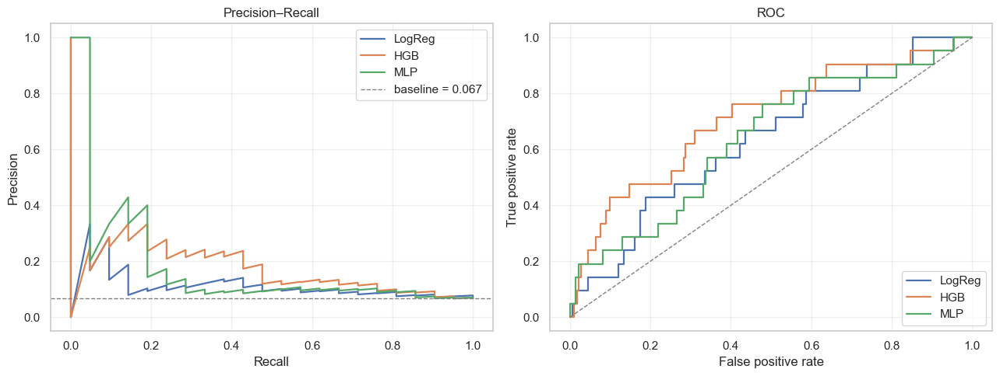
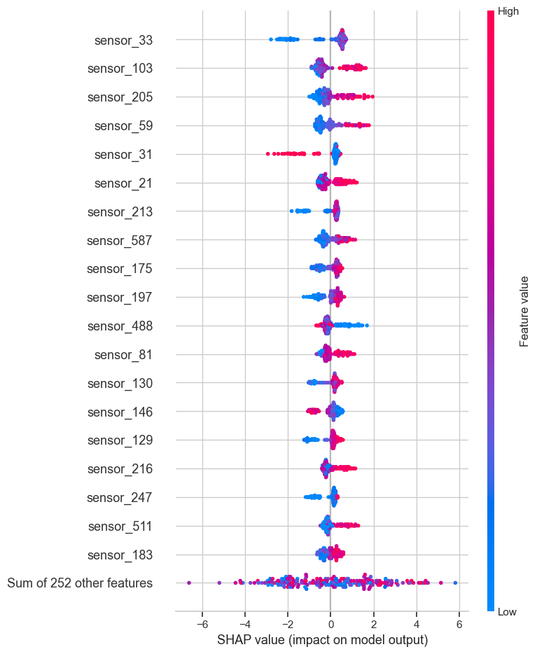
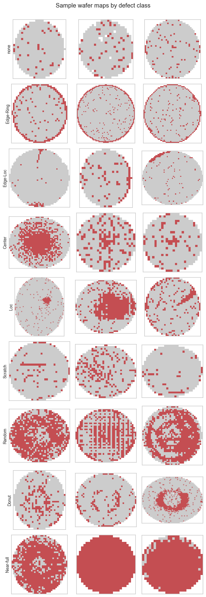
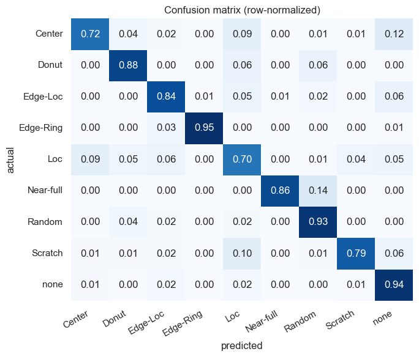

# Semiconductor Yield Prediction & Defect Analysis

Two end-to-end machine-learning projects on real semiconductor-manufacturing data. The framing is deliberate — these aren't "fit a model to a dataset" notebooks; each one walks through what a process- or yield-engineering team would actually want to know about the data and the resulting model.

| | Project | Dataset | Problem | Approach |
| - | --- | --- | --- | --- |
| 1 | Yield prediction from process sensors | UCI [SECOM](https://archive.ics.uci.edu/dataset/179/secom) | Predict pass/fail of finished wafers from 590 in-line sensor signals | Heavy preprocessing → logistic regression / gradient boosting / MLP comparison → threshold tuning + SHAP |
| 2 | Wafer-map defect classification | Kaggle [WM-811K](https://www.kaggle.com/datasets/qingyi/wm811k-wafer-map) | Classify wafer-map defect *patterns* (8 patterns + 'none') | Small convolutional network with class-weighted loss |

## Repo layout

```
.
├── README.md                       # you are here
├── requirements.txt
├── data/
│   ├── raw/                        # downloaded; not committed
│   └── processed/                  # generated by notebook 02
├── notebooks/
│   ├── 01_secom_eda.ipynb          # what the data actually looks like
│   ├── 02_secom_wrangling.ipynb    # cleaning pipeline → cached arrays
│   ├── 03_secom_modeling.ipynb     # three models + SHAP
│   ├── 04_wm811k_eda.ipynb         # wafer-map distribution and samples
│   └── 05_wm811k_cnn.ipynb         # CNN defect classifier
├── src/                            # reusable helpers used by the notebooks
│   ├── data_io.py
│   ├── preprocessing.py
│   ├── modeling.py
│   └── plots.py
├── reports/                        # CSV result tables + exported figures
└── models/                         # trained artifacts; gitignored
```

## Setup

```bash
python3 -m venv .venv
source .venv/bin/activate
pip install -r requirements.txt
```

The notebooks expect their working directory to be `notebooks/`. JupyterLab/VS Code do this automatically; if you're running with `jupyter nbconvert --execute`, run it from inside `notebooks/`.

## Getting the data

**SECOM** (small, public, no auth):

```bash
mkdir -p data/raw/secom
curl -L -o data/raw/secom/secom.data \
  https://archive.ics.uci.edu/ml/machine-learning-databases/secom/secom.data
curl -L -o data/raw/secom/secom_labels.data \
  https://archive.ics.uci.edu/ml/machine-learning-databases/secom/secom_labels.data
```

**WM-811K** (~150 MB compressed, ~2 GB unpacked):

The easiest way is via the `kagglehub` package, which downloads public Kaggle datasets anonymously:

```bash
pip install kagglehub
python -c "import kagglehub, shutil, os; \
  p = kagglehub.dataset_download('qingyi/wm811k-wafer-map'); \
  shutil.copy(os.path.join(p, 'LSWMD.pkl'), 'data/raw/wm811k/LSWMD.pkl')"
```

Or, if you have a Kaggle CLI configured:

```bash
kaggle datasets download -d qingyi/wm811k-wafer-map -p data/raw/wm811k/ --unzip
```

## Running

Notebooks are intended to run in order. Phase 1 (SECOM) is self-contained — notebook 02 reads `data/raw/secom/`, writes to `data/processed/`, and notebook 03 reads from there. Phase 2 (WM-811K) is independent of phase 1.

```bash
cd notebooks/
jupyter nbconvert --to notebook --execute 01_secom_eda.ipynb --inplace
jupyter nbconvert --to notebook --execute 02_secom_wrangling.ipynb --inplace
jupyter nbconvert --to notebook --execute 03_secom_modeling.ipynb --inplace
jupyter nbconvert --to notebook --execute 04_wm811k_eda.ipynb --inplace
jupyter nbconvert --to notebook --execute 05_wm811k_cnn.ipynb --inplace
```

## Results

### SECOM — pass/fail classification

Held-out test set (314 wafers, 6.6% positive). PR-AUC is the primary metric — accuracy is misleading at this imbalance, and ROC-AUC understates how hard the rare-positive problem actually is. Random-baseline PR-AUC is ≈ 0.066.

_Numbers below come from running notebook 03 with `RANDOM_STATE=42`. See `reports/secom_results.csv` for the raw table._

| Model | PR-AUC | ROC-AUC | F1 @0.5 | F1 (tuned) | Recall (tuned) |
| --- | --- | --- | --- | --- | --- |
| Logistic regression (baseline) | 0.125 | 0.635 | 0.127 | 0.172 | 0.667 |
| Histogram gradient boosting | **0.182** | **0.711** | 0.000 | **0.220** | 0.619 |
| Small MLP | 0.184 | 0.638 | 0.216 | 0.178 | 0.667 |



The HGB row's F1 at the default 0.5 threshold is zero because, with `class_weight="balanced"`, the calibrated probabilities for fails never quite cross 0.5 — the model is well-calibrated to the true 6.6% base rate. That's exactly why we threshold-tune. After tuning, HGB has the strongest F1 of the three.

The threshold-tuning rule: among thresholds with recall ≥ 0.60, pick the one with the highest precision. This encodes the asymmetric cost of missing a defective wafer in a fab — better to flag a few extras for inspection than to ship a bad one.

#### What drives the predictions?

SHAP summary on the gradient-boosting model. Features are anonymized as `sensor_N`, so I can't name physical processes — but the shape of the importance distribution itself is informative: a handful of sensors carry most of the signal, with a long flat tail. That pattern matches what process engineers report about yield drivers in real fabs.



### WM-811K — defect-pattern classification

Held-out test set, 9 classes, heavily imbalanced toward 'none'. Macro-F1 is the headline metric.

Sample wafer maps by class — pass dies in grey, fails in red:



| Model | macro-F1 (test) | accuracy | notes |
| --- | --- | --- | --- |
| Small CNN (3 conv blocks, GAP + dense head) | **0.733** | 0.923 | per-class F1 ranges from 0.49 (Loc) to 0.97 (Edge-Ring) |

Per-class breakdown — the spatially distinctive patterns (Edge-Ring, Random, Donut, Near-full, 'none') all score F1 ≥ 0.67. The hard classes are 'Loc' and 'Scratch', which overlap visually at 64×64.



## Notes on choices

- **HistGradientBoostingClassifier instead of XGBoost.** I started with XGBoost but the local environment had a libomp/architecture conflict. Scikit-learn's HGB is a histogram-based gradient booster with similar characteristics and one fewer external dependency. If you want to swap in XGBoost yourself, uncomment it in `requirements.txt`; the notebook only needs a `predict_proba`-capable classifier.
- **PyTorch instead of Keras for the CNN.** Tried Keras first; the local TensorFlow install was unhappy and PyTorch was already on the machine, so I pivoted. PyTorch is also a lighter dependency for a model this size.
- **sklearn's `MLPClassifier` for the SECOM MLP.** With ~1,200 training rows there's no win from a custom training loop. Sklearn handles class balance through SMOTE upstream, early stopping is built in, and the result is honest.
- **No KNN imputation.** Tempting on high-dim sensor data but slow at this row count and not obviously better than median imputation here.
- **No data augmentation for the WM-811K CNN.** Wafer maps carry meaningful orientation (notches, flat edges) so the usual rotation/flip augmentation is unsafe without domain-aware modification. Left as future work.
- **Threshold tuning for SECOM, not for WM-811K.** SECOM is a binary, asymmetric-cost problem where the threshold is a real operational lever. WM-811K is multiclass and the operating choice is more nuanced; argmax is fine for a baseline.

## What I'd try next

- For SECOM: feed sensor IDs back through a SHAP analysis on a properly held-out validation set, and try a stacked model (HGB → calibrated logistic head) to see whether calibration helps the threshold choice.
- For WM-811K: train at 96×96 with rotation-equivariant augmentation; try a small ResNet variant; look at the unlabeled portion of the dataset for semi-supervised pretraining.
- A common preprocessing layer for both: time-aware features for SECOM (the labels file has timestamps; sensor drift across the recording window probably matters) and lot-level features for WM-811K.
